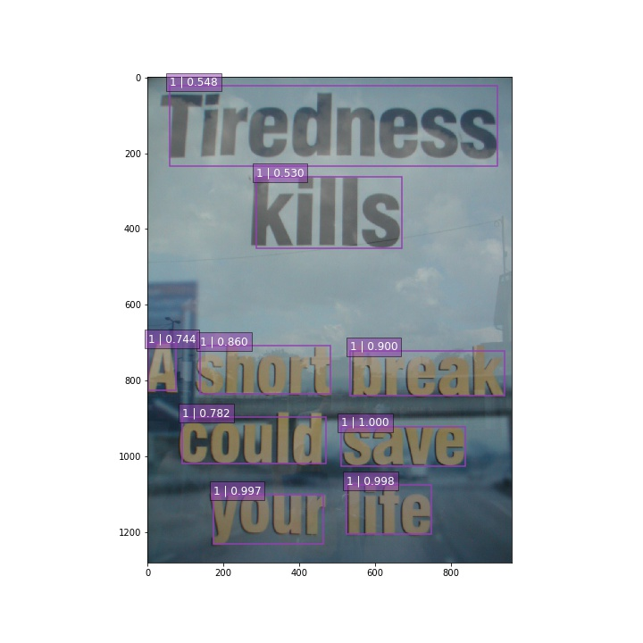
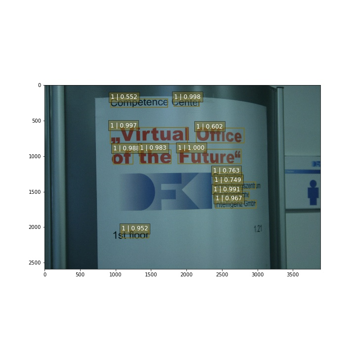

# TextBoxes-TensorFlow
TextBoxes re-implementation using tensorflow.
Much more info can be found in [Textbox](https://arxiv.org/pdf/1611.06779.pdf) and [SSD](https://arxiv.org/abs/1512.02325)
This project is greatly inspired by [slim project](https://github.com/tensorflow/models/tree/master/slim)  
And many functions are modified based on [SSD-tensorflow project](https://github.com/balancap/SSD-Tensorflow)  
Now the pipeline is much clear and can be resued in any tf projects.

Author: 
	Daitao Xing : dx383@nyu.edu
	Jin Huang   : jh5442@nyu.edu

# Result

For now, the model can detect most of boxes. But still has poor performance on small objects. 




# Train

## Train from scratch
You can train this model from scratch by using following command.

``` bash
DATASET_DIR=./data/sythtext/
TRAIN_DIR=./logs/train/logs614
TF_ENABLE_WINOGRAD_NONFUSED=1 CUDA_VISIBLE_DEVICES=4,5,6,7 setsid python Textbox_train.py \
	--train_dir=${TRAIN_DIR} \
	--dataset_dir=${DATASET_DIR} \
	--save_summaries_secs=60 \
	--save_interval_secs=1800 \
	--weight_decay=0.0005 \
	--optimizer=momentum \
	--learning_rate=0.001 \
	--batch_size=8 \
	--num_samples=800000 \
	--gpu_memory_fraction=0.95 \
	--max_number_of_steps=500000 \
    --use_batch=False \
	--num_clones=4 \
	--checkpoint_path=${CHECKPOINT_PATH} \
    --checkpoint_model_scope=text_box_300 \
    --ignore_missing_vars=True \
```

## Evalation on checkpoint

```bash

CHECKPOINT_PATH=./logs/train/logs614
EVAL_DIR=./logs/eval/logs614
DATASET_DIR=./data/ICDAR2013/test
CUDA_VISIBLE_DEVICES=4 setsid python eval.py \
    --eval_dir=${EVAL_DIR} \
    --dataset_dir=${DATASET_DIR} \
    --checkpoint_path=${CHECKPOINT_PATH} \
    --wait_for_checkpoints=True \
    --batch_size=1 \
    --gpu_memory_fraction=0.02 \
    --use_batch=False \
```

# Problems to be solved： 

1. Anchor boxes size is very important. Many small objects can't be matched with any anchor boxes. This is a drawback of SSD. 
2. BatchNorm help a lot. Batch norm will imporove accurary by 5-10% percentage.
3. Tensorflow is ineffecient compared with Caffe. For now this pipiline is under optimization. The speed is about 3 sec/step on sigle gpu(K80) where batch size is 32. 
4. Training as long as you can. I can't reproduce the result from scratch with only training 50K times. The result above is the result training after 150K


